# Alea Optima

A minimalist and portable solo tabletop RPG in which you explore procedurally generated Worlds in your mind.

---

<a href="https://www.kesiev.com/alea-optima/">Play</a> | <a href="https://www.kesiev.com/alea-optima/learn.html">Learn</a> | <a href="https://www.kesiev.com/alea-optima/playthrough.html">Sample playthrough</a> | <a href="https://discord.gg/TeAWvnuGku">Discord</a>

---

## The story

_20XX. In an effort to get the most immersive experience possible for players, some games have attempted to generate stories directly in their minds. A mysterious digital agent has taken control of one of these games..._

## The project

**Alea Optima** is a minimalist solo narrative tabletop RPG: you will narrate the adventures of a brave adventurer by yourself using dice, tables, character sheets, and maps to get inspiration for places, events, challenges, and encounters with people and creatures.

    
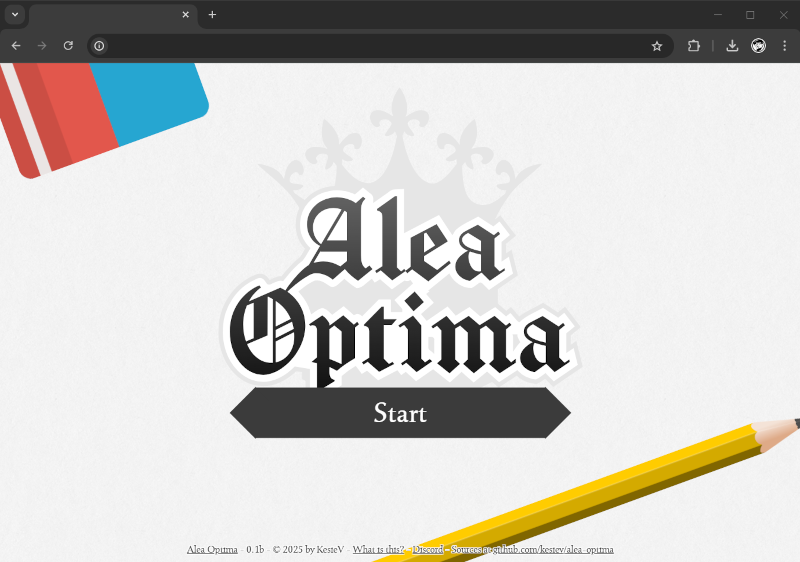

It uses randomly generated **Region Booklets** in a roguelike fashion to suggest what you may find in your wanderings, mixing stuff from a larger database of terms, events, and interactions. This way, you may find exotic places, have weird encounters, and discover mysterious secrets in your mind.

To play, you need the following:
 - **A printer, some A4 sheets, and a pair of scissors:** this game uses foldable booklets both for the game manual and the Region Booklets. These booklets are small enough to be easily carried around and play as you've some spare time.
 - **A pencil and an eraser:** you will keep track of your character's stats and draw a map of the World regions as you explore them.
 - **A small token:** you will keep track of your character's position on the map using a small token. You can use anything small enough, such as a button, a coin, or a small cube.
 - **3 light dice and 3 dark dice:** you will use 6 dice, 3 lighter and 3 darker, to get inspiration for your story and check the outcome of your character's actions.

    
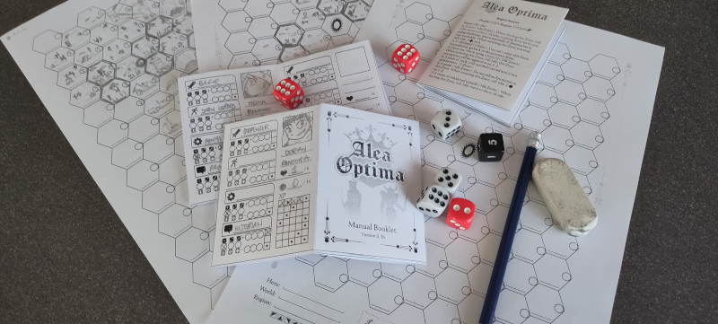

You can learn more [here](https://www.kesiev.com/alea-optima/learn.html).

### Why?

In these years, I've worked [on](https://github.com/kesiev/massive-randomness-2) [a](https://github.com/kesiev/roguecairn) [whole](https://github.com/kesiev/stampadia-generals) [lot](https://github.com/kesiev/stampadia-travelers) [of](https://github.com/kesiev/crimsonbranch) [printable](https://github.com/kesiev/stampadia) [procedural](https://github.com/kesiev/kuroshimu) [games](https://github.com/kesiev/goldscrolls) and I had fun making and playing all of them. I also enjoyed my [experimental solo digital RPG detour](https://github.com/kesiev/tsomg), which I come back playing from time to time.

In the meanwhile, I've collected suggestions on all of them from friends and family, played more board games, RPGs, and video games and designed more ways to create similar games. To wrap everything up, I had to expand each of them or make a sequel.

Both options felt _like work_, so I attempted _wrapping_ the concepts I liked from these games into a single one and _hammering them_ altogether. That's **Alea Optima**.

Be warned: there are **a lot of spoilers** in this design document. If you want to play it, try becoming an Alea Optima **Traveler** at least once - even better if you discover how to be a **Seeker** or an **Enlightened**.

#### Kuroshimu

    
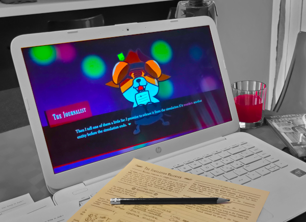

[Kuroshimu](https://github.com/kesiev/kuroshimu) is a procedural black box investigation game: guess what happened to 6 persons trapped by a cute journalist dog in an endlessly resetting simulated world.

##### Procedural Lore

Kuroshimu lets the player analyze the _legacy_ of a simulated world run by the game for a set amount of time. From that information, the player has to deduce (or sometimes _guess_) how the simulated entities interacted with each other and with the world to discover their secrets.

The generated legacy concept is not new in video games and every attempt has always intrigued me. In Alea Optima, the mysterious digital agent behind it won't only randomly generate a World to create the Region Booklets, but it will also hide the _legacies_ of a procedurally generated story for the player to discover.

##### The Story

_The Journalist_, a digital dog that lives in the digital part of the game, incarnates the _game master_, and it evaluates the player's deductions and guesses to give a score. Even if the generated _cases_ are unrelated to each other, the player will discover _The Journalist_'s story at every attempt, unfolding the secrets of the game.

To tell the story, I had to create a fitting UI for the game: I decided to make a visual-novel-style UI both to fit the narrative style and as a nod to the games it's inspired by.

I loved working on Kuroshimu's story but, despite it all, it was a _very hard game_ and few people managed to see it to the end. Alea Optima has a similar surrounding story too, so I've made another visual-novel-style UI. And, to not waste my work on Kuroshimu's story, I've made Alea Optima a _direct sequel_ to it...

#### Massive Randomness 2

    
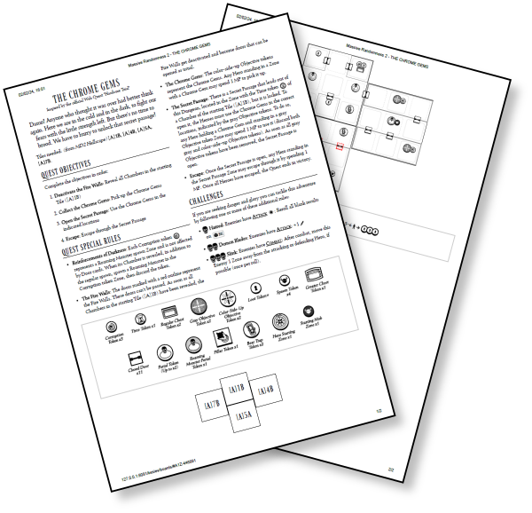

[Massive Randomness 2](https://github.com/kesiev/massive-randomness-2) is a Massive Darkness 2 board game random quest generator.

##### Hidden Lore

Massive Randomness 2 games are mostly self-contained one-shots as _Kuroshimu_ did. And, as _Kuroshimu_, it also offered a narrative arc that joined all the games together.

In Massive Randomness 2 I experimented with another way to do that. The story silently unfolds in the generated one-shots instead of the digital part and it uses 2 narrative arcs: an explicit one in the Campaign Mode and a _hidden_ one the player may stumble upon.

I had a lot of fun creating them, but it often happens that people accidentally miss these contents. Alea Optima includes a similar experience, but in a clearer way: the game is explicit about these arcs and the player will decide what to do accordingly.

#### RogueCairn

    
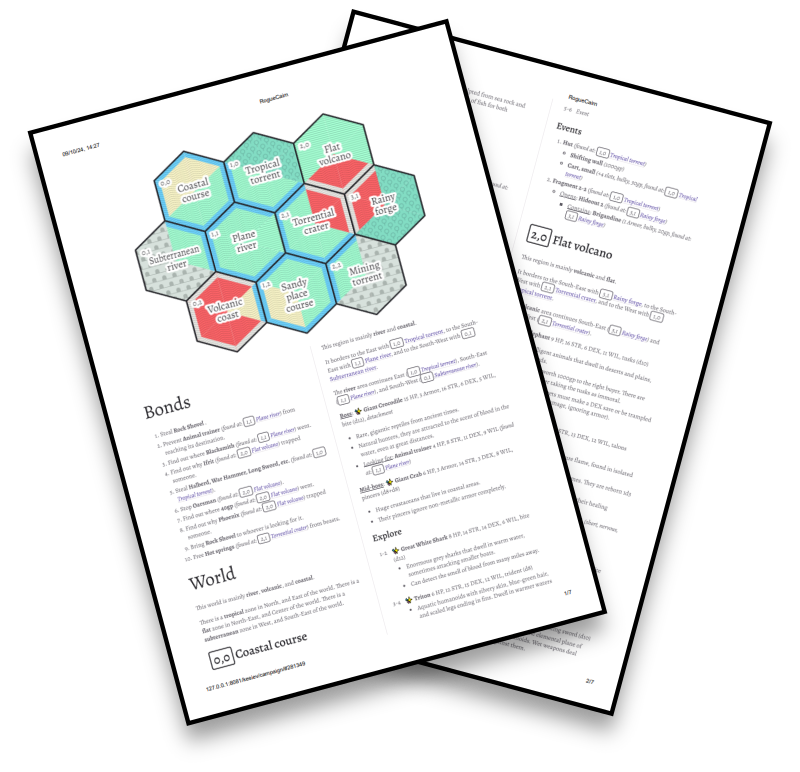

[RogueCairn](https://github.com/kesiev/roguecairn) is an open-source random generator of small worlds designed to be explored following Yochai Gal's Cairn adventure game rules.

##### Randomized Biomes

RogueCairn mixes biome pairs from a set to create the world map, creating some original and stimulating mixes. What is a _Frozen Shore_? What does a _Sacrifical beach_ look like? Biomes _expand_ on adjacent hexes to give more consistency and they also impact on the creatures living in each region, offering both enough space to the narrative and a some layer of coherence.

I've used a similar approach with Alea Optima, creating multiple intertwining biomes that impact the suggested narrative. Alea Optima inherits from the original _Chronicles of Stampadia_ and from some modern narrative tabletop RPGs the minimal narrative: voices, events, and enemies are just briefly described but are selected according to that Region's biomes.

##### Oracle Generation

RogueCairn describes a world map, the creatures living in each region, and their interests and connections. It may also include descriptions of the weather and the factions contending each region. But encounters, key items, and places are arranged in region-specific oracle tables instead of being statically described: they will appear and challenge the players randomly during their errands. RogueCairn challenges the players to set in motion a _static, coherent, pre-generated world_ with their _dynamic, chaotic, player-controlled events_.

Alea Optima explores this concept more, tuning this static/dynamic boundary a little - mainly by _zooming in_ on the map. Each world region is still procedurally generated, but now they can be explored zone-by-zone using region-specific procedurally generated oracles for Places, Creatures, and Events. The procedural creature relations generation cannot be replicated effectively, so it has been replaced by the Encounter Type oracle table: the player will now have to interpret a random word to establish the intentions of the characters he will meet along the way. These terms may change from world to world and from region to region, giving an _attitude_ to their inhabitants.

#### Dungeons of Crimsonbranch

    
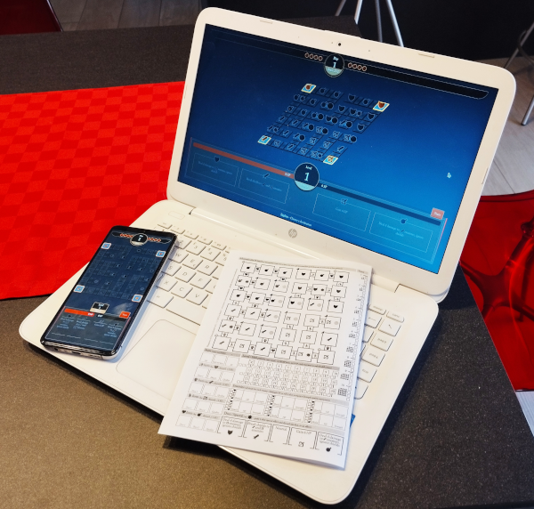

[Dungeons of Crimsonbranch](https://github.com/kesiev/crimsonbranch) is a tiny adventure dice game you can play on a computer, a mobile device, or a sheet of paper, inspired by looter hack'n'slash RPG video games.

##### Dice Manipulation

Dungeons of Crimsonbranch featured a dice manipulation game for solving battles. For my tastes, it was simple enough and worked well with the progress system, giving enough sense of progression: it focused on giving the sense of power but losing a little _thrill_ as a result.

For Alea Optima tests, I decided to adapt a classic _push-your-luck_ dice game adding some dice Crimsonbranch-like manipulation to it. I opted for _Blackjack_, which is fast and simple. Writing down and erasing scores is time-consuming, so I opted for using a set number of dice to sum and manipulate on the fly.

##### Teleporting

In Dungeons of Crimsonbranch, the player has to explore 4 dungeons to collect all the pearls. When the player hero dies, it loses all of the hard-earned unused experience points so, if things go badly, leaving the dungeon using the staircases placed at the labyrinth's dead ends may be a good idea.

It is a way to make dying not so impacting as for the looter hack'n'slash RPG games it's inspired by, but still keeping it annoying in a [Dark Souls](https://en.wikipedia.org/wiki/Dark_Souls_(video_game))-esque way.

Death in Alea Optima works as in classic old-school RPGs: your character cannot be used again. Anyway, the game has a Crimsonbranch-like _leave and return_ mechanic, briefly described by the Extra Rules manual's section as **Teleporting to another Region**. It's quite an unusual rule for solo RPGs and It's not explained nor clear what this rule is for but, for players _with a special purpose_, it will be your best ally.

#### The Stampadia series

    
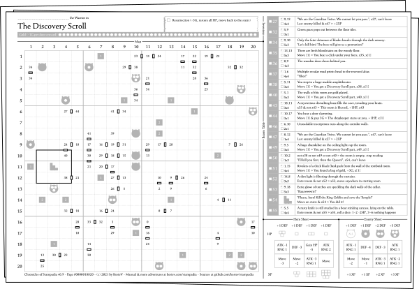

[Chronicles of Stampadia](https://github.com/kesiev/stampadia) is a daily print-and-play roguelike adventure you can play offline.

    
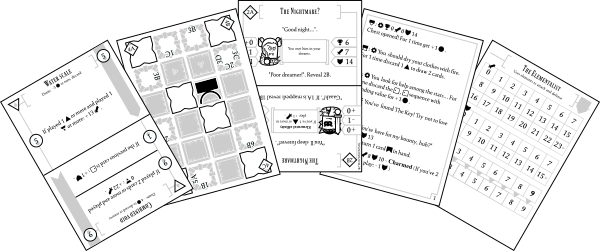

[Travelers of Stampadia](https://github.com/kesiev/stampadia-travelers) is the Chronicles of Stampadia card game spin-off. A daily print-and-play roguelike adventure card game you can play offline.

    
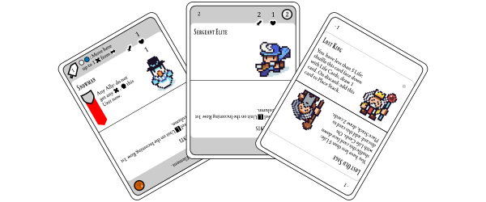

[Generals of Stampadia](https://github.com/kesiev/stampadia-generals) is the third chapter of the Stampadia series. An open-source print-and-play solo Expandable Card Game.

##### The Spacing Incident

The key design limit I imposed myself for the first Chronicles of Stampadia was a space limit: a whole adventure sheet had to fit a single A4 sheet face. Because of this constraint, the game was English only - as it needs fewer words to explain concepts - and every room event had to be explained in 2 very short lines. I've been very happy with the trade-off but I read around some complaints about the game's unavailability in other languages and the very restricting size limits.

Travelers of Stampadia, a card-based spin-off of Chronicles of Stampadia, used cards to solve both problems: they offer more space and it is very common in these games to use symbols instead of words to describe game elements. This way I've been able to translate it into Italian too.

Alea Optima attempts to solve the space problem with another solution: using folded booklets (which are coming from [another project of mine](https://github.com/kesiev/rewtro)), I've even more room for text. Yeah, it sacrifices the signature _hidden dungeon map_ feature but it helps me on another point...

##### Expectations

The _hybrid_ and _disposable_ nature of Chronicles of Stampadia's adventures has been a _mixed blessing_.

If seen as I originally meant it, Chronicles of Stampadia adventures should be consumed as one-shots: when you've some spare time just print one, play it, and you're done. You may keep it as a memory or reset it and give it to a friend to play - like you do with _crosswords_. Since it's a dice-based game and knowing the map in advance may help you on better decisions, you may attempt to play it again to improve your score. But it's just a little _extra_: to play a different adventure you had to print another adventure sheet.

But, if seen as a _print-and-play dungeon crawler_, things change: print-and-play games usually are _board games you can print by yourself_, so a higher level of replayability is expected from the material you've printed.

Travelers of Stampadia moved to the _printable board game_ a little more, giving the player small procedurally generated card decks that can be used multiple times: the same hero can be played on multiple maps and _Overworld maps_ regions are shuffled to be randomly placed, creating different routes and enemies.

Generals of Stampadia even moved further that way, trading the procedural generation with the classic _board game_ features: replayability and expandability.

Alea Optima embraces the _tabletop RPG_ route to reach a trade-off. It works respecting the canons of the genre, offering a framework for a _hexcrawl_ narrative experience and allowing the same Region Booklet to be played multiple times. But it also offers 2 flavors of Stampadia randomness: the player may explore a single World looking for variety, or keep spawning on different Worlds for more unpredictability.

##### Activities

The Chronicles and Travelers of Stampadia features several interactions that use of the game material and rules in unusual ways. In some Chronicles quests you may find _investigative logic_ minigames (later ported to _Massive Randomness 2_), _metroidvania-like_ explorations, simple _environmental puzzles_, and so on. Travelers use the card limitations to simulate the _hero's memory_ of the dungeon, simple inventories, and more.

While these interactions are pretty common in board games, they are a little rarer in tabletop RPGs. I've added some of them in Alea Optima to give it a little twist. Since the game uses 6 dice, a pencil, an eraser, a character sheet, and a multi-page booklet there are many opportunities to create an improved version of these activities. So, around Alea Optima's Worlds, you may encounter gamblers, medics, bounty hunters, and more, offering their unique interactions and narrative opportunities.

#### The Scroll of Many Glances

    
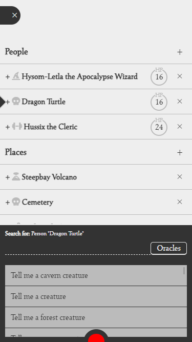

[The Scroll of Many Glances](https://github.com/kesiev/tsomg) is an experimental app-supported masterless fantasy RPG thought for mobile devices inspired by PbtA and OSR tabletop role-play games.

##### Yet Another Solo RPG

In 2023 I attempted to make a _weird_ TTRPG called "The Scroll of Many Glances". It is played on mobile or a computer but it still works as a TTRPG: it's more a _smart note-taking application_ that helps you track stuff on simple character and place sheets and suggests encounters, actions, events, and outcomes when you're out of ideas, silently rolling on tables peeking at your notes. The narration happens _in your mind_ as it happens in solo RPGs - the software is just here to give you a little push when you need it.

Alea Optima seems unrelated to that project but I've borrowed and extended 2 key features from that project: the game portability, now implemented as smaller booklets instead of as a mobile app, and the open gameplay, as Alea Optima offers a classic game flow but it invites you to play it as you prefer.

#### Goldscrolls

    
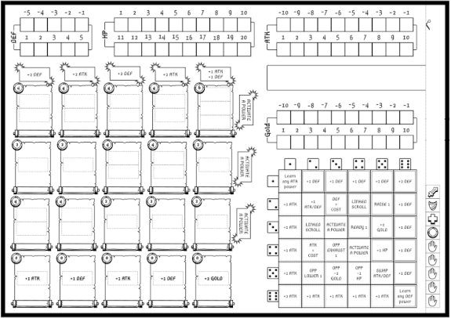

[Goldscrolls](https://github.com/kesiev/goldscrolls) is a fast print-and-play roll-and-write deck-building game for two players.

##### Code Legacy

Even if it's pretty unknown, Goldscrolls laid the foundation for all of the printable games I've made so far - at least from the coding perspective. From centering text in a rectangle to printing symbols, then arranging cards, and finally laying out a procedurally generated booklet it has been a long road...

#### And More!

Alea Optima also have its own new features. I hope you'll have fun finding them!

### Tech stuff

#### Updating the database

The game data is stored in a single [LibreOffice Calc spreadsheet](assets/data/data.ods), converted into [JSON files](database/) by a Node script. There also is an auto-generated [database stats document](DATABASE.md) with a summary of what's inside. Well, all this stuff is full of spoilers - you've been warned.

If you want to update the database:

 - Clone this project and serve the root folder with the web server you like - _Alea Optima_ has no server components.
 - Use [LibreOffice](https://www.libreoffice.org/) to update the [spreadsheet](assets/data/data.ods) as you please.
 - Make sure you've installed `node` and `npm`.
 - Point a terminal to the [assets/data](assets/data/) directory.
 - The first time, run `npm install` to install the script dependencies.
 - Run `node .\export.js` to export spreadsheet data to the game database. It will also update the [database stats document](DATABASE.md).

Feel free to share your _database chunks_: I'm happy to add new biomes, narrative lines, etc. into the _Alea Optima blender_!

#### Duplicates review

I've prepared a script [here](assets/evaluator/) that evaluates [sentence similarity](https://www.npmjs.com/package/@xenova/transformers) across the database narrative parts. 

The Alea Optima database has been filled by hand over multiple days, so during reviews, I've stumbled upon repeated or too-similar sentences. While this script is not perfect, it helped me identify some of them.

To run it, enter its directory, run `npm install`, run `node .\evaluate.js`, and then check the `results.md` file.

### Credits

#### Assets

  - [Seshat](http://dotcolon.net/font/seshat/) font by Dot Colon
  - [Ferrum](https://dotcolon.net/font/ferrum) font by Dot Colon
  - [UTM Times](https://www.fontspace.com/utm-times-font-f17236) font by Thienminhdesign
  - [LSW Drachenklaue](https://www.deviantart.com/retsamys/art/Free-fantasy-font-LSW-Drachenklaue-548816202) font by RetSamys
  - [Chomsky](https://github.com/ctrlcctrlv/chomsky) font by ctrlcctrlv (used by the logo)

#### Tools

  - [Inkscape](https://inkscape.org/) for SVG editing
  - [Visual Studio Code](https://code.visualstudio.com/) for coding
  - [Font Squirrel](https://www.fontsquirrel.com/) for converting fonts
  - [Obsidian](https://obsidian.md/) for project management
  - [LibreOffice](https://www.libreoffice.org/) for data entry and manipulation

#### Libraries

  - [jsPdf](https://github.com/parallax/jsPDF)

#### People

Thanks to these people for keeping my cogs running:
  - [Bianca](http://www.linearkey.net/)
  - [Preuk](https://mastodon.social/@Preuk@framapiaf.org)
  - Stefano "The Kusagari" Fioretto
